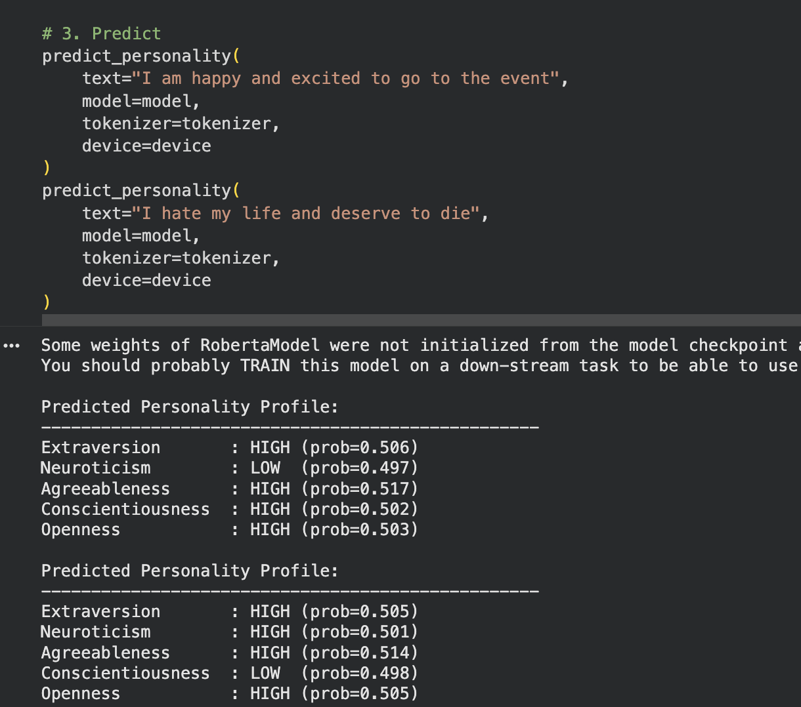

# Text-Personality-Classifier

AURA Technical Stream Text-Based Personality Classifier

Data Source: https://huggingface.co/datasets/jingjietan/essays-big5 

OneDrive Link for Saved Models: https://utoronto-my.sharepoint.com/:f:/g/personal/xiaotong_shen_mail_utoronto_ca/Ek2yhwjwLy9AlI4ReEolzfoBx1C0Lq_qzv1kbzzzYWbwog?e=zxH1IH 

### Current Status (11/20/25):

The initial status from last week is that Emily trained a regression model with continuous outputs for trait expression rather than binary (MSE). 

This week, we were also attempting to use train a classifier model with binary outputs for trait expression (BSE with Logits Loss), since the given data is in binary form. (Although the big 5 personality traits is scored on a 7 point scale, the essay data souce is from 0-1, reducing to a high/low binary). In addition, many of the literature on Big 5/applying Big 5 uses this reduced binary form, so it may serve better with our applications.

More on the Classifier Model
- Decided to keep best model according to F1 score rather than binary accuracy as the data was more imbalanced (i.e it was more likely that the text had extroversion trait high), so accuracy wasn't a great metric
- Messed around which a bunch of the parameters such as learning rate, batch size, etc, and highest F1 score achived was 0.685. (which still is not great, so looking at improvements) (Named Best_F1_model.pt on the sharepoint)

Small Test:

Next Steps:
- Looking at some other data sources (currently 1.5k rows for training), and looking into merging the data to get a larger sample size without compromising the integrity of the source as a whole.
- Alternatively, looking into how to better finetune BERT on small batches of data.
- Make stronger testing functions for the models on sharepoint.
